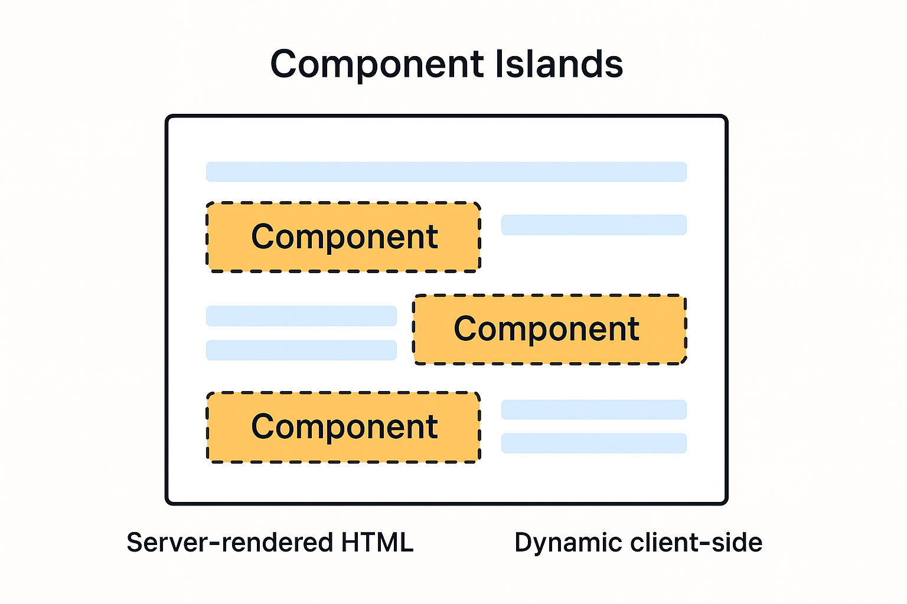

最初是从[Astro](https://docs.astro.build/en/concepts/islands/)知道Compoents Islands这个词汇的。

“Component Island（组件岛屿）”这个术语最早由Etsy的前端架构师 Katie Sylor-Miller 在2019年提出。Preact 的创始人 Jason Miller 在2020年8月11日进一步扩展并整理了这个想法。

“Islands（岛屿）”架构的核心理念看似简单：先在服务端渲染整个HTML页面，在那些**需要动态交互的部分**留出“占位符”或“插槽”，这些部分会在客户端“水化”（hydration）成独立的小型组件，这些组件会重用原本服务器渲染的HTML。
这就像一座“静态HTML大陆”中，插入了几个“活跃的组件岛屿”。这样既保留了 SSR（服务器渲染）的加载速度，又保留了部分JS组件的交互能力。
这种架构模式所依赖的技术被称为“部分水化”或“选择性水化” （partial or selective hydration)。

与传统SPA一次性水化整个页面不同，这里只水化“动态部分”组件，避免了无谓的资源浪费。相比之下，大多数基于JavaScript的前端框架，会将整个网站当作一个大型的JavaScript应用进行整体水化和渲染（即SPA）。SPA架构简单且功能强大，但由于大量依赖客户端JavaScript，会造成页面加载速度慢等性能问题。

Astro 成为了第一个原生支持“选择性水化”的主流JavaScript框架，它正是基于 Sylor-Miller 提出的“组件岛屿”模式。
总之，**“组件岛屿”架构是一种将静态页面和动态组件有机结合的前端技术模式。** 它解决了SPA页面加载慢的问题，同时保留了动态交互的能力。而Astro是最先原生支持这一理念的框架，因此迅速流行起来。

